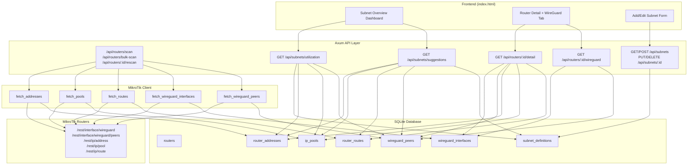
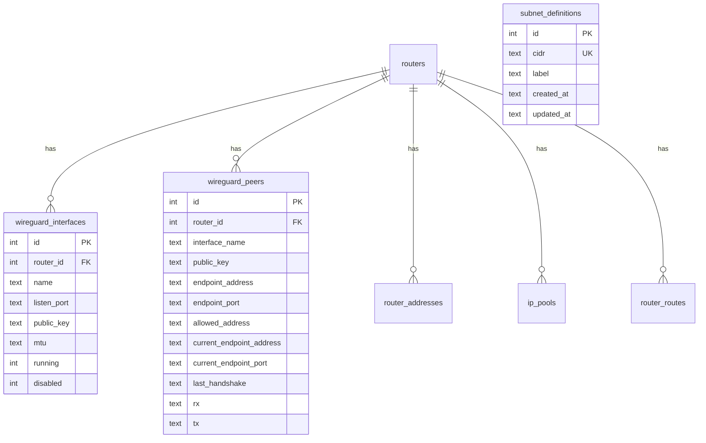

# Design Document: WireGuard IP Utilization

## Overview

This feature adds two major capabilities to Netking IPAM:

1. **WireGuard Data Collection** — During router scans, the system fetches WireGuard interface and peer data from MikroTik routers via the RouterOS REST API, storing it alongside existing IP address/pool/route data.

2. **Subnet Utilization Dashboard** — A user-defined subnet registry with automatic IP utilization calculation that aggregates used IPs from router addresses, IP pools, and WireGuard peer allowed-addresses, presenting a visual overview of available vs. used IP space.

The design integrates seamlessly into the existing scan workflow (graceful degradation on WireGuard fetch errors), adds three new database tables, expands the MikroTik client, and introduces new API endpoints for subnet CRUD and utilization queries. The frontend receives a new "Subnet Overview" navigation section.

## Architecture

### Data Flow Diagram



### Key Design Decisions

| Decision | Rationale |
|----------|-----------|
| WireGuard fetch errors don't fail the scan | Graceful degradation — older RouterOS versions may not support WireGuard REST endpoints |
| Replace-all strategy for WireGuard data on each scan | Consistent with existing `replace_router_addresses`, `replace_ip_pools`, `replace_router_routes` patterns |
| Utilization computed on-demand (not cached) | Subnet definitions are few (typically <50), computation is fast against indexed SQLite tables |
| Subnet definitions are user-managed with auto-suggestions | Operators know their network topology; suggestions reduce manual entry |
| Single `allowed_address` text field storing the raw value | MikroTik returns comma-separated allowed-address list; stored as-is for flexibility |

## Components and Interfaces

### 1. MikroTik Client Additions (`src/mikrotik.rs`)

Two new public methods on `MikrotikClient`:

```rust
/// Fetches WireGuard interfaces from /rest/interface/wireguard
pub async fn fetch_wireguard_interfaces(
    &self,
    wireguard_ip: &str,
    username: &str,
    password: &str,
) -> AppResult<Vec<WireguardApiInterface>>

/// Fetches WireGuard peers from /rest/interface/wireguard/peers
pub async fn fetch_wireguard_peers(
    &self,
    wireguard_ip: &str,
    username: &str,
    password: &str,
) -> AppResult<Vec<WireguardApiPeer>>
```

### 2. New API Models (`src/models.rs`)

```rust
// --- MikroTik API response types ---

#[derive(Debug, Clone, Serialize, Deserialize)]
pub struct WireguardApiInterface {
    pub name: String,
    #[serde(rename = "listen-port")]
    pub listen_port: Option<String>,
    #[serde(rename = "public-key")]
    pub public_key: Option<String>,
    #[serde(rename = "private-key")]
    pub private_key: Option<String>,
    pub mtu: Option<String>,
    pub running: Option<String>,
    pub disabled: Option<String>,
}

#[derive(Debug, Clone, Serialize, Deserialize)]
pub struct WireguardApiPeer {
    pub interface: Option<String>,
    #[serde(rename = "public-key")]
    pub public_key: Option<String>,
    #[serde(rename = "endpoint-address")]
    pub endpoint_address: Option<String>,
    #[serde(rename = "endpoint-port")]
    pub endpoint_port: Option<String>,
    #[serde(rename = "allowed-address")]
    pub allowed_address: Option<String>,
    #[serde(rename = "current-endpoint-address")]
    pub current_endpoint_address: Option<String>,
    #[serde(rename = "current-endpoint-port")]
    pub current_endpoint_port: Option<String>,
    #[serde(rename = "last-handshake")]
    pub last_handshake: Option<String>,
    pub rx: Option<String>,
    pub tx: Option<String>,
}

// --- Database records ---

#[derive(Debug, Clone, Serialize, Deserialize, FromRow)]
pub struct WireguardInterfaceRecord {
    pub id: i64,
    pub router_id: i64,
    pub name: String,
    pub listen_port: Option<String>,
    pub public_key: Option<String>,
    pub mtu: Option<String>,
    pub running: bool,
    pub disabled: bool,
    pub created_at: String,
    pub updated_at: String,
}

#[derive(Debug, Clone, Serialize, Deserialize, FromRow)]
pub struct WireguardPeerRecord {
    pub id: i64,
    pub router_id: i64,
    pub interface_name: Option<String>,
    pub public_key: Option<String>,
    pub endpoint_address: Option<String>,
    pub endpoint_port: Option<String>,
    pub allowed_address: Option<String>,
    pub current_endpoint_address: Option<String>,
    pub current_endpoint_port: Option<String>,
    pub last_handshake: Option<String>,
    pub rx: Option<String>,
    pub tx: Option<String>,
    pub created_at: String,
    pub updated_at: String,
}

#[derive(Debug, Clone, Serialize, Deserialize, FromRow)]
pub struct SubnetDefinitionRecord {
    pub id: i64,
    pub cidr: String,
    pub label: String,
    pub created_at: String,
    pub updated_at: String,
}

// --- API request/response types ---

#[derive(Debug, Clone, Deserialize)]
pub struct CreateSubnetRequest {
    pub cidr: String,
    pub label: String,
}

#[derive(Debug, Clone, Deserialize)]
pub struct UpdateSubnetRequest {
    pub cidr: Option<String>,
    pub label: Option<String>,
}

#[derive(Debug, Clone, Serialize)]
pub struct WireguardDataResponse {
    pub interfaces: Vec<WireguardInterfaceRecord>,
    pub peers: Vec<WireguardPeerRecord>,
}

#[derive(Debug, Clone, Serialize)]
pub struct SubnetUtilizationResponse {
    pub subnets: Vec<SubnetUtilization>,
}

#[derive(Debug, Clone, Serialize)]
pub struct SubnetUtilization {
    pub id: i64,
    pub cidr: String,
    pub label: String,
    pub total_hosts: u64,
    pub used_count: u64,
    pub available_count: u64,
    pub utilization_pct: f64,
    pub used_ips: Vec<UsedIpEntry>,
}

#[derive(Debug, Clone, Serialize)]
pub struct UsedIpEntry {
    pub ip: String,
    pub sources: Vec<IpSource>,
}

#[derive(Debug, Clone, Serialize)]
pub struct IpSource {
    pub source_type: String,   // "address", "pool", "wireguard_peer"
    pub router_id: i64,
    pub router_name: String,
    pub detail: Option<String>, // interface name, pool name, peer public-key prefix
}

#[derive(Debug, Clone, Serialize)]
pub struct SubnetSuggestion {
    pub cidr: String,
    pub proposed_label: String,
    pub source_description: String,
}
```

### 3. New API Routes

| Method | Path | Handler | Description |
|--------|------|---------|-------------|
| GET | `/api/routers/:id/wireguard` | `get_router_wireguard` | WireGuard data for a router |
| GET | `/api/subnets` | `list_subnets` | All subnet definitions |
| POST | `/api/subnets` | `create_subnet` | Create a subnet definition |
| PUT | `/api/subnets/:id` | `update_subnet` | Update a subnet definition |
| DELETE | `/api/subnets/:id` | `delete_subnet` | Delete a subnet definition |
| GET | `/api/subnets/utilization` | `get_subnet_utilization` | Compute utilization for all subnets |
| GET | `/api/subnets/suggestions` | `get_subnet_suggestions` | Auto-detect subnets from scanned data |

### 4. Modified Scan Flow (`scan_router_payload`)

The existing `scan_router_payload` function is extended:

```rust
// After fetching addresses, pools, routes (existing flow)...

// NEW: Fetch WireGuard data (non-fatal)
let wg_interfaces = match state
    .mikrotik
    .fetch_wireguard_interfaces(&wireguard_ip, &credentials.username, &credentials.password)
    .await
{
    Ok(ifaces) => ifaces,
    Err(err) => {
        tracing::warn!(router_id, %wireguard_ip, %err, "WireGuard interfaces fetch failed");
        Vec::new()
    }
};

let wg_peers = match state
    .mikrotik
    .fetch_wireguard_peers(&wireguard_ip, &credentials.username, &credentials.password)
    .await
{
    Ok(peers) => peers,
    Err(err) => {
        tracing::warn!(router_id, %wireguard_ip, %err, "WireGuard peers fetch failed");
        Vec::new()
    }
};

replace_wireguard_interfaces(&state.pool, router_id, &wg_interfaces).await?;
replace_wireguard_peers(&state.pool, router_id, &wg_peers).await?;
```

### 5. IP Utilization Calculation Module (`src/utilization.rs`)

A new module dedicated to subnet utilization computation:

```rust
pub async fn compute_utilization(
    pool: &SqlitePool,
    subnets: &[SubnetDefinitionRecord],
) -> AppResult<Vec<SubnetUtilization>>
```

## Data Models

### New Database Tables (Migration `0003_wireguard_subnets.sql`)

```sql
-- WireGuard interfaces collected from MikroTik routers
CREATE TABLE IF NOT EXISTS wireguard_interfaces (
    id INTEGER PRIMARY KEY AUTOINCREMENT,
    router_id INTEGER NOT NULL,
    name TEXT NOT NULL,
    listen_port TEXT,
    public_key TEXT,
    mtu TEXT,
    running INTEGER NOT NULL DEFAULT 0,
    disabled INTEGER NOT NULL DEFAULT 0,
    created_at TEXT NOT NULL DEFAULT CURRENT_TIMESTAMP,
    updated_at TEXT NOT NULL DEFAULT CURRENT_TIMESTAMP,
    FOREIGN KEY(router_id) REFERENCES routers(id) ON DELETE CASCADE
);

CREATE INDEX IF NOT EXISTS idx_wg_interfaces_router_id ON wireguard_interfaces(router_id);

-- WireGuard peers collected from MikroTik routers
CREATE TABLE IF NOT EXISTS wireguard_peers (
    id INTEGER PRIMARY KEY AUTOINCREMENT,
    router_id INTEGER NOT NULL,
    interface_name TEXT,
    public_key TEXT,
    endpoint_address TEXT,
    endpoint_port TEXT,
    allowed_address TEXT,
    current_endpoint_address TEXT,
    current_endpoint_port TEXT,
    last_handshake TEXT,
    rx TEXT,
    tx TEXT,
    created_at TEXT NOT NULL DEFAULT CURRENT_TIMESTAMP,
    updated_at TEXT NOT NULL DEFAULT CURRENT_TIMESTAMP,
    FOREIGN KEY(router_id) REFERENCES routers(id) ON DELETE CASCADE
);

CREATE INDEX IF NOT EXISTS idx_wg_peers_router_id ON wireguard_peers(router_id);
CREATE INDEX IF NOT EXISTS idx_wg_peers_allowed_address ON wireguard_peers(allowed_address);

-- User-defined subnet labels for IP utilization tracking
CREATE TABLE IF NOT EXISTS subnet_definitions (
    id INTEGER PRIMARY KEY AUTOINCREMENT,
    cidr TEXT NOT NULL UNIQUE,
    label TEXT NOT NULL,
    created_at TEXT NOT NULL DEFAULT CURRENT_TIMESTAMP,
    updated_at TEXT NOT NULL DEFAULT CURRENT_TIMESTAMP
);

CREATE INDEX IF NOT EXISTS idx_subnet_definitions_cidr ON subnet_definitions(cidr);
```

### Entity Relationship



### IP Utilization Calculation Algorithm

```
function compute_utilization(subnets, db):
    for each subnet in subnets:
        net = parse_cidr(subnet.cidr)
        total_hosts = 2^(host_bits) - 2   // exclude network + broadcast for IPv4
        
        // Collect used IPs from all sources
        used_map: HashMap<IpAddr, Vec<IpSource>> = {}
        
        // Source 1: Router addresses (e.g., "10.0.0.1/24" → host IP 10.0.0.1)
        for each addr in router_addresses where extract_host_ip(addr.address) is in net:
            used_map.entry(ip).or_default().push(IpSource{
                source_type: "address",
                router_id, router_name,
                detail: addr.interface
            })
        
        // Source 2: IP pool ranges — expand each range, check membership
        for each pool in ip_pools:
            for each scope in parse_ranges(pool.raw_ranges):
                for each ip in expand_scope(scope) where ip is in net:
                    used_map.entry(ip).or_default().push(IpSource{
                        source_type: "pool",
                        router_id, router_name,
                        detail: pool.pool_name
                    })
        
        // Source 3: WireGuard peer allowed-addresses
        for each peer in wireguard_peers:
            for each addr_str in peer.allowed_address.split(","):
                ip = extract_host_ip(addr_str.trim())
                if ip is in net:
                    used_map.entry(ip).or_default().push(IpSource{
                        source_type: "wireguard_peer",
                        router_id, router_name,
                        detail: truncated_public_key
                    })
        
        used_count = used_map.len()
        available_count = total_hosts - used_count
        utilization_pct = (used_count as f64 / total_hosts as f64) * 100.0
        
        yield SubnetUtilization { subnet, total_hosts, used_count, available_count, utilization_pct, used_ips }
```

**Performance considerations:**
- For typical ISP subnets (/24 to /22), expansion is bounded (254–1022 hosts).
- Larger pools (/16 = 65534 hosts) are feasible but the algorithm avoids expanding beyond /16 ranges to prevent memory issues. For pools with prefix < 16, only occupied IPs are tracked (no full expansion).
- All data is read in bulk from SQLite and processed in-memory.

## Correctness Properties

*A property is a characteristic or behavior that should hold true across all valid executions of a system — essentially, a formal statement about what the system should do. Properties serve as the bridge between human-readable specifications and machine-verifiable correctness guarantees.*

### Property 1: WireGuard API data serialization round-trip

*For any* valid `WireguardApiInterface` or `WireguardApiPeer` value (with arbitrarily generated field combinations including None optionals), serializing to JSON and then deserializing back SHALL produce an equivalent value.

**Validates: Requirements 1.2, 2.2**

### Property 2: Replace-all semantics for WireGuard data

*For any* router ID and any two consecutive non-empty lists of WireGuard interfaces (or peers), after calling the replace function with the first list and then the second list, querying the database SHALL return only the records from the second list (identical contents, correct router_id association).

**Validates: Requirements 1.4, 2.4**

### Property 3: CIDR validation accepts valid networks and rejects malformed input

*For any* valid IPv4 CIDR string (generated as `{a}.{b}.{c}.{d}/{prefix}` where the host bits are zero and prefix is 0–32) or valid IPv6 CIDR, the validation function SHALL accept it. *For any* string that is not a well-formed CIDR (missing slash, invalid octets, prefix > 32 for IPv4, non-numeric components), the validation function SHALL reject it.

**Validates: Requirements 5.4**

### Property 4: Utilization calculation invariants

*For any* valid subnet definition (CIDR with prefix ≤ 30 for IPv4) and any set of IP addresses distributed across router_addresses, ip_pools, and wireguard_peers sources:
- `total_hosts` SHALL equal `2^(host_bits) - 2` (excluding network and broadcast addresses)
- `used_count` SHALL equal the number of **unique** IP addresses from all sources that fall within the subnet (excluding network/broadcast)
- `available_count` SHALL equal `total_hosts - used_count`
- `utilization_pct` SHALL equal `(used_count / total_hosts) * 100.0`
- Each entry in `used_ips` SHALL list **all** sources that reference that IP (deduplication with full source attribution)
- The network address and broadcast address SHALL never appear in `used_ips` even if present in source data

**Validates: Requirements 6.2, 6.3, 6.5, 6.6**

### Property 5: Subnet suggestion extraction finds all valid CIDRs from source data

*For any* collection of router_addresses (with network fields), ip_pools (with derived_network fields), router_routes (with dst_address in CIDR notation), and wireguard_peers (with allowed-address fields containing valid CIDRs), the suggestion extraction function SHALL return every unique valid CIDR found across all sources.

**Validates: Requirements 7.2**

### Property 6: Suggestions exclude already-defined subnets

*For any* set of existing `SubnetDefinition` records and any set of discovered subnets from scanned data, the suggestions list SHALL be exactly the set difference: `discovered_subnets - existing_subnets`. No suggestion SHALL have the same CIDR as an existing definition.

**Validates: Requirements 7.3**

## Error Handling

| Scenario | Behavior | User Impact |
|----------|----------|-------------|
| WireGuard endpoint returns HTTP error (404, 500) | Log warning, continue scan with empty WG data | Router scan succeeds; WireGuard section shows "No data" |
| WireGuard endpoint times out | Same as HTTP error — graceful degradation | Same as above |
| Invalid CIDR in subnet creation request | Return 400 with validation error message | Form shows error, no record created |
| Duplicate CIDR in subnet creation | Return 409 Conflict with message | Form shows "subnet already exists" |
| Subnet ID not found for PUT/DELETE | Return 404 | UI shows "subnet not found" |
| Router ID not found for `/api/routers/:id/wireguard` | Return 404 | UI shows "router not found" |
| IP pool range too large to expand (>/16) | Skip full expansion, only count occupied IPs | Utilization may undercount for very large pools |
| Database write failure during WireGuard replace | Return 500, transaction rolled back | Existing data preserved, scan reported as error |
| Malformed allowed-address in peer data | Skip that entry in utilization calculation | IP not counted; logged as warning |

### Error Response Format

Consistent with existing pattern in `app_error.rs`:

```json
{
  "error": "descriptive error message"
}
```

## Testing Strategy

### Property-Based Tests (using `proptest` crate)

Each property test runs a minimum of 100 iterations. The `proptest` crate is already available in the Rust ecosystem and integrates well with the existing test infrastructure.

| Property | Test Location | Tag |
|----------|--------------|-----|
| Property 1: Serialization round-trip | `src/mikrotik.rs` (tests module) | Feature: wireguard-ip-utilization, Property 1: WireGuard API data serialization round-trip |
| Property 2: Replace-all semantics | `src/routes.rs` or `tests/wireguard_db.rs` | Feature: wireguard-ip-utilization, Property 2: Replace-all semantics for WireGuard data |
| Property 3: CIDR validation | `src/net.rs` (tests module) | Feature: wireguard-ip-utilization, Property 3: CIDR validation |
| Property 4: Utilization invariants | `src/utilization.rs` (tests module) | Feature: wireguard-ip-utilization, Property 4: Utilization calculation invariants |
| Property 5: Subnet suggestion extraction | `src/utilization.rs` (tests module) | Feature: wireguard-ip-utilization, Property 5: Subnet suggestion extraction |
| Property 6: Suggestions exclude existing | `src/utilization.rs` (tests module) | Feature: wireguard-ip-utilization, Property 6: Suggestions exclude already-defined subnets |

### Unit Tests (Example-Based)

- CIDR validation: specific valid/invalid examples (empty string, "192.168.1.0/24", "not-a-cidr", "/32")
- WireGuard graceful degradation: mock HTTP 404/500 response, verify scan continues
- Duplicate subnet creation: verify 409 response
- Router not found: verify 404 response
- Authentication enforcement: verify 401 without token

### Integration Tests

- Full scan flow with mocked MikroTik responses including WireGuard data
- Bulk scan with mixed success/failure for WireGuard endpoints
- Subnet CRUD lifecycle (create → read → update → delete)
- Utilization endpoint with known data → verify exact counts

### File Changes Summary

| File | Change Type | Description |
|------|-------------|-------------|
| `migrations/0003_wireguard_subnets.sql` | **New** | Schema for wireguard_interfaces, wireguard_peers, subnet_definitions |
| `src/mikrotik.rs` | **Modified** | Add `fetch_wireguard_interfaces` and `fetch_wireguard_peers` methods |
| `src/models.rs` | **Modified** | Add WireGuard API types, DB records, subnet types, utilization response types |
| `src/utilization.rs` | **New** | IP utilization calculation module |
| `src/net.rs` | **Modified** | Add CIDR validation function, subnet membership helpers |
| `src/routes.rs` | **Modified** | Add subnet CRUD routes, utilization endpoint, suggestions endpoint, WireGuard endpoint; modify `scan_router_payload` and `get_router_detail` |
| `src/main.rs` | **Modified** | Register new module (`mod utilization`) |
| `static/index.html` | **Modified** | Add Subnet Overview section, WireGuard tab in router detail |
| `Cargo.toml` | **Modified** | Add `proptest` dev-dependency |

